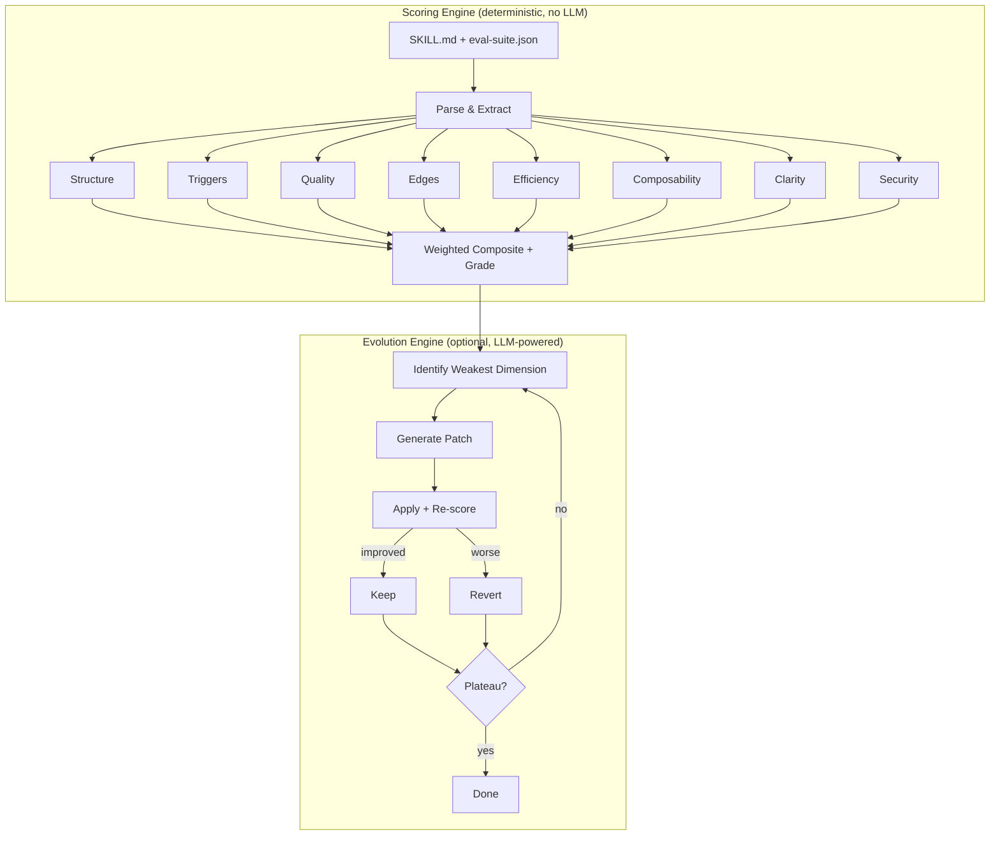

# Schliff

Your AI instructions are silently degrading. Schliff catches it.

<p align="center">
  <a href="https://pypi.org/project/schliff/"></a>
  <a href="https://pypi.org/project/schliff/"></a>
  <a href="https://pypi.org/project/schliff/"></a>
  <a href=".github/workflows/test.yml"></a>
  <a href="LICENSE"></a>
  <a href="https://github.com/Zandereins/schliff/stargazers"></a>
</p>

Deterministic quality scoring for AI instruction files — CLAUDE.md, SKILL.md, .cursorrules, AGENTS.md, system prompts. No LLM, no API key, same input → same score. Python 3.9+, zero dependencies.

```bash
pip install schliff
schliff score path/to/SKILL.md
```

<p align="center">
  
</p>

---

> We scored 100+ public instruction files. **73% score below C.**

- **Triggers overlap** — agents fire on wrong tasks, nobody notices until production breaks
- **Contradictions hide in long files** — "always X" vs "never X" buried 200 lines apart
- **Hedging wastes tokens** — "you might want to consider" is noise that dilutes intent
- **No eval suite means three dimensions score zero** — the most impactful ones

[Read the full report →](docs/launch/state-of-ai-instructions.md)

---

## What Schliff Catches

| Dimension | Weight | What it catches |
|-----------|--------|-----------------|
| structure | 15% | Missing frontmatter, empty headers, no examples, dead content |
| triggers | 20% | Eval-suite trigger accuracy, false positives, missed activations |
| quality | 20% | Thin assertions, missing feature coverage, low coherence |
| edges | 15% | No edge cases defined, missing categories (invalid, scale, unicode) |
| efficiency | 10% | Hedging, filler words, repetition, low signal-to-noise |
| composability | 10% | Missing scope boundaries, no error behavior, no handoff points |
| clarity | 5% | Contradictions, vague references, ambiguous instructions |
| security | 5% | *(opt-in)* Hardcoded secrets, unsafe commands, exposed credentials |

Grades: **S** (≥95) · **A** (≥85) · **B** (≥75) · **C** (≥65) · **D** (≥50) · **E** (≥35) · **F** (<35). Full methodology: [docs/SCORING.md](docs/SCORING.md)

---

## Results

| Skill | Score | Rounds | Author |
|-------|-------|--------|--------|
| agent-review-panel | 64 [D] → 85.6 [A] | 3 | [@wan-huiyan](https://github.com/wan-huiyan) |
| shieldclaw (OpenClaw) | 68 [C] → 94.6 [A] | 1 | [@Zandereins](https://github.com/Zandereins) |
| demo skill | 54 [D] → 98.3 [S] | 18 auto | [@Zandereins](https://github.com/Zandereins) |

> "It's become a core part of my skill development workflow!" — [@wan-huiyan](https://github.com/wan-huiyan)

wan-huiyan used schliff to improve [agent-review-panel](https://github.com/wan-huiyan/claude-client-proposal-slide): SKILL.md went from 1,331 to 340 lines — **75% token reduction** via `references/` extraction. A/B testing confirmed identical review quality with fewer tokens.

**Score yours:** `schliff score path/to/SKILL.md` — [share what you find](https://github.com/Zandereins/schliff/issues/new?template=share_results.md)

---

## Quick Start

```bash
schliff score path/to/SKILL.md          # score any instruction file
schliff score --url https://github.com/user/repo/blob/main/SKILL.md
schliff suggest path/to/SKILL.md         # ranked fixes with impact estimates
schliff compare skill-v1.md skill-v2.md  # side-by-side comparison
schliff doctor                           # scan all installed skills
```

Or try in the browser: **[Web Playground](web/playground/)**

---

## Evolution Engine

54 → 98 in 18 iterations. One command.

```bash
pip install schliff[evolve]             # adds LLM support (via litellm)
schliff evolve path/to/SKILL.md         # score → improve → re-score → repeat
```

The evolution engine applies deterministic patches first (free, no LLM), then uses an LLM for what rules can't fix — structural reorganization, example generation, edge case synthesis. Only improvements that pass all dimension guards are kept. Rejects are reverted automatically.

```
  structure         70 → 100     Frontmatter, examples, concrete commands
  triggers           0 → 100     Description keywords, negative boundaries
  quality            0 →  95     Eval suite generated, assertions added
  edges              0 → 100     Edge cases synthesized
  efficiency        35 →  93     Hedging removed, information density up
  composability     30 →  90     Scope boundaries, error behavior, deps
  clarity           90 → 100     Vague references resolved
```

---

## CI Integration

```bash
schliff verify path/to/SKILL.md --min-score 75 --regression
```

```yaml
# .pre-commit-config.yaml
repos:
  - repo: https://github.com/Zandereins/schliff
    rev: v7.1.0
    hooks:
      - id: schliff-verify
        args: ['--min-score', '75']
```

---

## Anti-Gaming

Schliff detects score inflation. The [benchmark suite](benchmarks/anti-gaming/) catches 6 gaming patterns:

| Gaming attempt | How caught |
|----------------|-----------|
| Empty headers | Content check — empty sections penalized |
| Keyword stuffing | Dedup + frequency cap |
| Copy-paste examples | Repeated-line detection (94 → 43) |
| Contradictions | "always X" vs "never X" finder |
| Bloated preamble | Signal-to-noise via sqrt density curve |
| Missing scope | 10 composability sub-checks |

---

<details>
<summary><b>All commands</b></summary>

| Command | Purpose |
|---------|---------|
| `schliff demo` | See schliff in action instantly |
| `schliff score <path>` | Score any instruction file |
| `schliff score --url <url>` | Score a remote file (HTTPS-only) |
| `schliff score --tokens` | Section-by-section token breakdown |
| `schliff suggest <path>` | Ranked fixes with estimated impact |
| `schliff compare <a> <b>` | Side-by-side comparison with deltas |
| `schliff diff <path>` | Score delta vs. previous commit |
| `schliff verify <path>` | CI gate — exit 0/1, `--min-score`, `--regression` |
| `schliff doctor` | Scan all installed skills |
| `schliff badge <path>` | Generate markdown badge |
| `schliff report <path>` | Markdown quality report |
| `schliff evolve <path>` | Autonomous improvement loop |

**Claude Code skills** (require `bash install.sh`):

| Command | Purpose |
|---------|---------|
| `/schliff:auto` | Autonomous improvement with EMA-based stopping |
| `/schliff:init <path>` | Bootstrap eval suite + baseline |
| `/schliff:analyze` | One-shot gap analysis |
| `/schliff:mesh` | Detect trigger conflicts across skills |
| `/schliff:report` | Generate shareable report with badge |

</details>

<details>
<summary><b>How it differs from autoresearch</b></summary>

Inspired by [Karpathy's autoresearch](https://github.com/karpathy/autoresearch) — but Schliff is a **linter**, not a research loop. `schliff score` runs in CI without touching the improvement loop.

| | autoresearch | Schliff |
|---|---|---|
| **Target** | ML training scripts | AI instruction files |
| **Patches** | 100% LLM | 60-70% deterministic, 30-40% LLM |
| **Scoring** | 1 metric | 7 dimensions + optional runtime |
| **Anti-gaming** | None | 6 detection vectors |
| **Dependencies** | ML frameworks | Python 3.9+ stdlib only |
| **Tests** | Minimal | [1007 unit](skills/schliff/tests/unit/) + [99 integration](skills/schliff/scripts/test-integration.sh) |

</details>

<details>
<summary><b>Architecture</b></summary>



60-70% of patches follow deterministic rules. The LLM handles structural reorganization, example generation, edge case synthesis.

</details>

---

## Limitations

The structural score measures **file organization**, not runtime effectiveness. A skill scoring 95/100 can still produce wrong output — use `--runtime` scoring for that.

The trigger scorer uses TF-IDF heuristics. Skills with generic domain vocabulary may hit a precision ceiling around 75-80.

---

## Badge

```bash
schliff badge path/to/SKILL.md
```

[![Schliff: 99 [S]](https://img.shields.io/badge/Schliff-99%2F100_%5BS%5D-brightgreen)](https://github.com/Zandereins/schliff)

## Contributing

Found a scoring bug? Add a test case and [open an issue](https://github.com/Zandereins/schliff/issues). Want to improve scoring logic? Edit `scoring/*.py`, run the tests, PR the diff.

## License

MIT

---

*schliff (German) — the finishing cut. "Den letzten Schliff geben" = to give something its final polish.*
