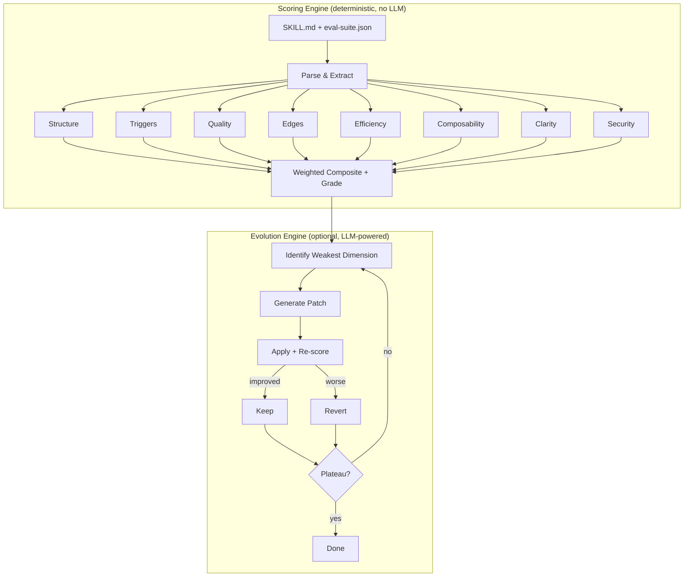

# Schliff

Your AI instructions are silently degrading. Schliff catches it.

Deterministic quality scoring for CLAUDE.md, SKILL.md, .cursorrules, AGENTS.md, and system prompts. No LLM, no API key — same input, same score. Python 3.9+, **zero core dependencies** (optional `schliff[evolve]` adds litellm for the evolution loop).

<p align="left">
  <a href="https://pypi.org/project/schliff/"></a>
  <a href="https://pypi.org/project/schliff/"></a>
  <a href="https://pypi.org/project/schliff/"></a>
  <a href=".github/workflows/test.yml"></a>
  <a href="LICENSE"></a>
</p>

```bash
pip install schliff
schliff score path/to/SKILL.md
```

```text
$ schliff score demo/bad-skill/SKILL.md
schliff v7.1.1

  structure      ███████░░░   70/100  fair
  efficiency     ████░░░░░░   35/100  poor
  composability  ███░░░░░░░   30/100  poor
  clarity        █████████░   90/100  great

  Structural Score  ███████████░░░░░░░░░  53.8/100  [D]
  ⚠ 4/8 dimensions measured (weight coverage: 40%). Unmeasured: triggers, quality, edges
  → 13 deterministic fixes available. Run `/schliff:auto` in Claude Code to apply.

  Tokens: 378 / 1,000 (ok)
```

---

## A real optimization

[@wan-huiyan](https://github.com/wan-huiyan) ran schliff on the 1,331-line SKILL.md for [agent-review-panel](https://github.com/wan-huiyan/agent-review-panel), a multi-agent code-review skill. Two optimization rounds later: **340 lines, 75% fewer tokens**, structure 65 → 100, composability 56 → 91. A/B tested on a 1,132-line document — identical review quality with a quarter of the tokens.

| Skill | Score | Rounds | Author |
|-------|-------|--------|--------|
| agent-review-panel | 75 [C] → 85.6 [A] | 2 | [@wan-huiyan](https://github.com/wan-huiyan) |
| shieldclaw (OpenClaw) | 68 [C] → 94.6 [A] | 1 | [@Zandereins](https://github.com/Zandereins) |
| demo bad-skill | 54 [D] → 98.3 [S] | 18 auto | [@Zandereins](https://github.com/Zandereins) |

**Score yours:** `schliff score path/to/SKILL.md` — [share what you find](https://github.com/Zandereins/schliff/issues/new?template=share_results.md)

---

## Seen in the wild

A root `CLAUDE.md` written for [`modelcontextprotocol/servers`](https://github.com/modelcontextprotocol/servers/pull/3733) (Anthropic's official MCP reference repo) merged to main on April 17th, 2026. Running schliff on it returned **59.2/100 at 40% weight coverage** — a useful measurement of where the file actually needed work and where the scorer was structurally unfair for a project-root document. [Full walkthrough →](https://fpaul.dev/writing/scoring-my-own-mcp-contribution/)

---

## What the data says

> We scored 120 public instruction files across 60 source repos. **Mean grade: D. 59% below C.** Adding one companion eval suite lifts the mean **+22 points**.

- **Composability is the real weak spot** — mean 30.4/100. Files tell agents what to do, rarely where to stop or hand off
- **No companion eval suite in the corpus** — verified 0/60 source repos ship an `eval-suite.json`, `evals/`, or any test artifact. Three dimensions stay unmeasured, locking 45% of the score
- **Hedging dilutes intent** — efficiency averages 52.8/100. "You might want to consider" is noise
- **Format alone doesn't save you** — AGENTS.md averages 64.8, SKILL.md 55.4. Skipping frontmatter costs ~15 points regardless of format

[Read the full report →](docs/launch/state-of-ai-instructions.md) · [Reproduce it](scripts/launch/)

---

## What Schliff Catches

| Dimension | Weight | What it catches |
|-----------|--------|-----------------|
| structure | 15% | Missing frontmatter, empty headers, no examples, dead content |
| triggers | 20% | Eval-suite trigger accuracy, false positives, missed activations |
| quality | 20% | Thin assertions, missing feature coverage, low coherence |
| edges | 15% | No edge cases defined, missing categories (invalid, scale, unicode) |
| efficiency | 10% | Hedging, filler words, repetition, low signal-to-noise |
| composability | 10% | Missing scope boundaries, no error behavior, no handoff points |
| clarity | 5% | Contradictions, vague references, ambiguous instructions |
| security | 5% | *(opt-in)* Hardcoded secrets, unsafe commands, exposed credentials |

Grades: **S** (≥95) · **A** (≥85) · **B** (≥75) · **C** (≥65) · **D** (≥50) · **E** (≥35) · **F** (<35). Full methodology: [docs/SCORING.md](docs/SCORING.md)

---

## Quick Start

```bash
schliff score path/to/SKILL.md          # score any instruction file
schliff score --url https://github.com/user/repo/blob/main/SKILL.md
schliff suggest path/to/SKILL.md         # ranked fixes with impact estimates
schliff compare skill-v1.md skill-v2.md  # side-by-side comparison
schliff doctor                           # scan all installed skills
```

`schliff suggest` returns the top fixes with their estimated point impact:

```text
$ schliff suggest demo/bad-skill/SKILL.md
TOP FIXES (estimated impact):
 1. [ ~25] Create eval-suite.json with trigger test cases (should_trigger: true/false prompts)
 2. [  ~8] Create eval-suite.json with 3+ test cases, each with typed assertions
 3. [  +2] Add 'description: <what this skill does and when to use it>' to frontmatter
 4. [  +2] Add handoff points: 'Then use X skill for...', 'If Y, instead use Z skill'
 5. [  +2] Add 'Use this skill when...' + 'Do NOT use for...' scope sections

Current: 53.8 [D]  →  Estimated after fixes: ~91.8 [A]
```

---

## Evolution Engine

Close the loop: score → patch → re-score → stop at plateau. One command.

```bash
pip install schliff[evolve]
schliff evolve path/to/SKILL.md
```

```
  structure         70 → 100     Frontmatter, examples, concrete commands
  triggers           0 → 100     Description keywords, negative boundaries
  quality            0 →  95     Eval suite generated, assertions added
  edges              0 → 100     Edge cases synthesized
  efficiency        35 →  93     Hedging removed, information density up
  composability     30 →  90     Scope boundaries, error behavior, deps
  clarity           90 → 100     Vague references resolved

  Composite         54 [D] → 98 [S]    18 iterations, 12 kept / 6 reverted
```

The engine applies deterministic patches first (free, no LLM), then uses an LLM for what rules can't fix — structural reorganization, example generation, edge case synthesis. Only improvements that pass all dimension guards are kept; rejects are reverted automatically.

---

## CI Integration

```bash
schliff verify path/to/SKILL.md --min-score 75 --regression
```

```yaml
# .pre-commit-config.yaml
repos:
  - repo: https://github.com/Zandereins/schliff
    rev: v7.1.1
    hooks:
      - id: schliff-verify
        args: ['--min-score', '75']
```

`--regression` fails the check if the score dropped versus the last successful run (history file in `.schliff/history.jsonl`). Pair with GitHub Actions to gate PRs on instruction-file quality the same way you gate on test coverage.

---

## Anti-Gaming

Schliff detects score inflation. The [benchmark suite](benchmarks/anti-gaming/) catches 6 gaming patterns:

| Gaming attempt | How caught |
|----------------|-----------|
| Empty headers | Content check — empty sections penalized |
| Keyword stuffing | Dedup + frequency cap |
| Copy-paste examples | Repeated-line detection (94 → 43) |
| Contradictions | "always X" vs "never X" finder |
| Bloated preamble | Signal-to-noise via sqrt density curve |
| Missing scope | 10 composability sub-checks |

---

<details>
<summary><b>How it compares to other AI-instruction linters</b></summary>

| | [agnix](https://github.com/agent-sh/agnix) | [AgentLinter](https://github.com/seojoonkim/agentlinter) | Schliff |
|---|---|---|---|
| **Approach** | 399 rules across 9 tools | 8-dim scoring + secret scan | 7-dim 0–100 composite + evolution loop |
| **Stack** | Rust (npm/cargo/brew) | Node.js (npx) | Python 3.9+ stdlib |
| **Core dependencies** | Rust toolchain | npm/node | **None** (core) |
| **Output** | Pass/fail rule violations | Score + diagnostics | Composite grade + ranked fixes + auto-improve |
| **Evolution loop** | — | — | ✅ `schliff evolve` (54→98 in 18 iter) |
| **Anti-gaming detection** | — | — | ✅ 6 detectors |
| **CI gate (regression)** | via action | via CLI exit | ✅ `--min-score` + `--regression` |

agnix is great if you want immediate rule-based validation with zero scoring nuance. AgentLinter adds scoring but no evolution. Schliff is the only tool that gives you a deterministic composite you can gate PRs on, plus an evolution engine that closes the loop.

</details>

<details>
<summary><b>How it differs from autoresearch</b></summary>

Inspired by [Karpathy's autoresearch](https://github.com/karpathy/autoresearch) — but Schliff is a **linter**, not a research loop. `schliff score` runs in CI without touching the improvement loop.

| | autoresearch | Schliff |
|---|---|---|
| **Target** | ML training scripts | AI instruction files |
| **Patches** | 100% LLM | 60-70% deterministic, 30-40% LLM |
| **Scoring** | 1 metric | 7 dimensions + optional runtime |
| **Anti-gaming** | None | 6 detection vectors |
| **Dependencies** | ML frameworks | Python 3.9+ stdlib only (core) |

</details>

<details>
<summary><b>All commands</b></summary>

| Command | Purpose |
|---------|---------|
| `schliff demo` | See schliff in action instantly |
| `schliff score <path>` | Score any instruction file |
| `schliff score --url <url>` | Score a remote file (HTTPS-only) |
| `schliff score --tokens` | Section-by-section token breakdown |
| `schliff suggest <path>` | Ranked fixes with estimated impact |
| `schliff compare <a> <b>` | Side-by-side comparison with deltas |
| `schliff diff <path>` | Score delta vs. previous commit |
| `schliff verify <path>` | CI gate — exit 0/1, `--min-score`, `--regression` |
| `schliff doctor` | Scan all installed skills |
| `schliff badge <path>` | Generate markdown badge |
| `schliff report <path>` | Markdown quality report |
| `schliff evolve <path>` | Autonomous improvement loop |

**Claude Code skills** (require `bash install.sh`):

| Command | Purpose |
|---------|---------|
| `/schliff:auto` | Autonomous improvement with EMA-based stopping |
| `/schliff:init <path>` | Bootstrap eval suite + baseline |
| `/schliff:analyze` | One-shot gap analysis |
| `/schliff:mesh` | Detect trigger conflicts across skills |
| `/schliff:report` | Generate shareable report with badge |

</details>

<details>
<summary><b>Architecture</b></summary>



60-70% of patches follow deterministic rules. The LLM handles structural reorganization, example generation, edge case synthesis.

</details>

---

## When Schliff isn't the right tool

- **LLM-based semantic understanding** — Schliff is pattern-based. If you need a model to reason about whether two paragraphs are *semantically* contradictory (vs. structurally), a scorer like AgentLinter will catch cases schliff misses
- **Creative-writing prompts** — the weights and dimensions are opinionated for coding-agent instructions. Applied to persona prompts or creative-writing system prompts, the composite number will be misleading
- **You don't want to write an eval suite** — 45% of the score stays unmeasured without one. The remaining 55% (structure, efficiency, composability, clarity) still gives useful signal, but the A/S grades are out of reach

## Limitations

The structural score measures **file organization**, not runtime effectiveness. A skill scoring 95/100 can still produce wrong output — use `--runtime` scoring for that.

The trigger scorer uses TF-IDF heuristics. Skills with generic domain vocabulary may hit a precision ceiling around 75-80.

---

## Badge

```bash
schliff badge path/to/SKILL.md
```

[![Schliff: 99 [S]](https://img.shields.io/badge/Schliff-99%2F100_%5BS%5D-brightgreen)](https://github.com/Zandereins/schliff)

## Contributing

Found a scoring bug? Add a test case and [open an issue](https://github.com/Zandereins/schliff/issues). Want to improve scoring logic? Edit `scoring/*.py`, run the tests, PR the diff.

## License

MIT

---

*schliff (German) — the finishing cut. "Den letzten Schliff geben" = to give something its final polish.*
