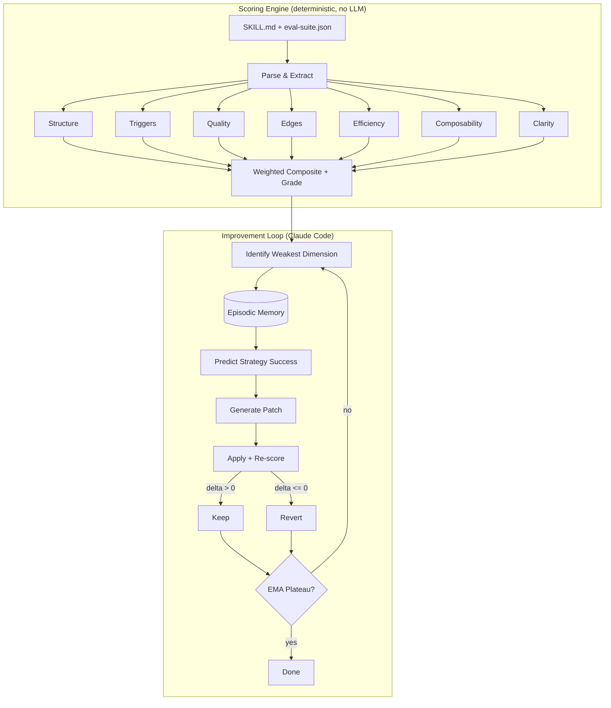

# Schliff

The quality score for AI instructions.

<p align="center">
  <a href="https://pypi.org/project/schliff/"></a>
  <a href="https://pypi.org/project/schliff/"></a>
  <a href="https://pypi.org/project/schliff/"></a>
  <a href=".github/workflows/test.yml"></a>
  <a href="LICENSE"></a>
  <a href="skills/schliff/scripts/score-skill.py"></a>
  <a href="https://github.com/Zandereins/schliff/stargazers"></a>
</p>

Deterministic static analysis for AI agent instruction files -- SKILL.md, CLAUDE.md, .cursorrules, AGENTS.md. Zero dependencies, no LLM needed, same input same score. Python 3.9+ stdlib only.

```bash
pip install schliff
schliff demo
```

<p align="center">
  
</p>

---

## Why?

- **Instruction files degrade silently.** Triggers overlap, agents fire on wrong tasks, nobody notices until production breaks.
- **Contradictions hide in long files.** "always X" vs "never X" buried 200 lines apart. No human catches that reliably.
- **No eval suite means three dimensions score zero.** Triggers, quality, and edges go unmeasured -- the most impactful dimensions.
- **Hedging wastes tokens.** "you might want to consider" is noise. Every filler phrase burns context window and dilutes intent.

---

## What Schliff Catches

| Dimension | Weight | What it catches |
|-----------|--------|-----------------|
| structure | 15% | Missing frontmatter, empty headers, no examples, dead content |
| triggers | 20% | Eval-suite trigger accuracy, false positives, missed activations |
| quality | 20% | Thin assertions, missing feature coverage, low coherence |
| edges | 15% | No edge cases defined, missing categories (invalid, scale, unicode) |
| efficiency | 10% | Hedging, filler words, repetition, low signal-to-noise |
| composability | 10% | Missing scope boundaries, no error behavior, no handoff points |
| clarity | 5% | Contradictions, vague references, ambiguous instructions |
| runtime | 10% | *(opt-in)* Actual Claude behavior against eval assertions |

Weights are renormalized across measured dimensions (sum to 1.0). Without `--runtime`, the 7 structural dimensions carry 100% of the score.

Grades: **S** (>=95) / **A** (>=85) / **B** (>=75) / **C** (>=65) / **D** (>=50) / **E** (>=35) / **F** (<35)

Full methodology and weight rationale: [docs/SCORING.md](docs/SCORING.md)

---

## Quick Start

Try in the browser first: **[Web Playground](web/playground/)** -- no install needed.

```bash
schliff score path/to/SKILL.md          # score any instruction file
schliff score --url https://github.com/user/repo/blob/main/SKILL.md  # score a remote file
schliff compare skill-v1.md skill-v2.md  # side-by-side comparison
schliff suggest path/to/SKILL.md         # ranked fixes with impact estimates
schliff doctor                           # scan all installed skills
```

Run `schliff --help` for the full command list (`report`, `verify`, `badge`, `diff`, `compare`).

### Autonomous improvement (requires Claude Code)

```bash
git clone https://github.com/Zandereins/schliff.git && bash schliff/install.sh

# Inside Claude Code:
/schliff:init path/to/SKILL.md    # bootstrap eval suite + baseline
/schliff:auto                      # patch -> measure -> keep or revert -> repeat
```

---

## State of AI Instructions

> We scored 100+ public instruction files. 73% score below C.
>
> [Read the full report](docs/launch/state-of-ai-instructions.md)

---

## CI Integration

```yaml
- uses: Zandereins/schliff@v7
  with:
    skill-path: '.claude/skills/my-skill/SKILL.md'
    minimum-score: '75'
```

Or use the CLI directly:

```bash
schliff verify path/to/SKILL.md --min-score 75 --regression
```

### Pre-commit Hook

```yaml
# .pre-commit-config.yaml
repos:
  - repo: https://github.com/Zandereins/schliff
    rev: v7.1.0
    hooks:
      - id: schliff-verify
        args: ['--min-score', '75']
```

---

## Results

| Skill | Before | After | Iterations | Author |
|-------|--------|-------|------------|--------|
| agent-review-panel | 64.0 [D] | 85.6 [A] | 3 rounds | [@wan-huiyan](https://github.com/wan-huiyan) |
| shieldclaw (OpenClaw plugin) | 68.3 [C] | 94.6 [A] | 1 round | [@Zandereins](https://github.com/Zandereins) |
| demo skill (`demo/bad-skill/`) | 54.0 [D] | 98.3 [S] | 18 | [@Zandereins](https://github.com/Zandereins) |

The demo skill -- a vague, hedging-filled deployment helper -- goes from [D] to [S] in 18 autonomous iterations:

```
  structure         70 -> 100     Frontmatter, examples, concrete commands
  triggers           0 -> 100     Description keywords, negative boundaries
  quality            0 -> 95      Eval suite generated, assertions added
  edges              0 -> 100     Edge cases synthesized
  efficiency        35 -> 93      Hedging removed, information density up
  composability     30 -> 90      Scope boundaries, error behavior, deps
  clarity           90 -> 100     Vague references resolved
```

Real-world skills vary. Complex skills plateau around [A] to [S] depending on eval suite coverage.

*Run `schliff score` on your skill and [add your result](https://github.com/Zandereins/schliff/edit/main/README.md).*

### Community

> "It's become a core part of my skill development workflow!" -- [@wan-huiyan](https://github.com/wan-huiyan)

[@wan-huiyan](https://github.com/wan-huiyan) used schliff to improve [agent-review-panel](https://github.com/wan-huiyan/claude-client-proposal-slide) from 64 to 85.6 across three rounds. Along the way, SKILL.md went from 1,331 to 340 lines -- a 75% token reduction via `references/` extraction. A/B testing on a 1,132-line document confirmed identical review quality with fewer tokens.

### Used by

- [@wan-huiyan](https://github.com/wan-huiyan) -- agent-review-panel (64 -> 85.6, 3 rounds)
- [@Zandereins](https://github.com/Zandereins) -- shieldclaw, OpenClaw plugin (68.3 -> 94.6, 1 round)
- *[Add your project](https://github.com/Zandereins/schliff/issues/new?template=share_results.md)*

---

## Anti-Gaming

Schliff detects score inflation. The [benchmark suite](benchmarks/anti-gaming/) tests 6 common gaming patterns -- all caught:

| Gaming attempt | How Schliff catches it |
|----------------|----------------------|
| Empty headers (inflate structure) | Header content check -- empty sections penalized |
| Keyword stuffing (inflate triggers) | Dedup + frequency cap on repeated terms |
| Copy-paste examples | Repeated-line detection -- score drops 94 -> 43 |
| Contradictory instructions | "always X" vs "never X" contradiction finder |
| Bloated preamble | Signal-to-noise ratio via sqrt density curve |
| Missing scope boundaries | 10 composability sub-checks, not a single binary |

Reproduce: `python benchmarks/anti-gaming/run.py`

---

## Commands

| Command | Purpose |
|---------|---------|
| `schliff demo` | See schliff in action instantly |
| `schliff score <path>` | Score any instruction file (SKILL.md, CLAUDE.md, .cursorrules, AGENTS.md) |
| `schliff score --url <url>` | Score a remote file from GitHub (HTTPS-only) |
| `schliff suggest <path>` | Ranked fixes with estimated score impact |
| `schliff doctor` | Scan all installed skills, health grades, drift analysis |
| `schliff verify <path>` | CI gate -- exit 0/1, `--min-score`, `--regression` |

<details>
<summary><b>All commands</b> (<code>schliff --help</code>)</summary>

| Command | Purpose |
|---------|---------|
| `schliff score --tokens` | Section-by-section token breakdown with format-specific budgets |
| `schliff compare <a> <b>` | Side-by-side quality comparison with dimension deltas |
| `schliff diff <path>` | Show score delta vs. previous commit (or any `--ref`) |
| `schliff badge <path>` | Generate copy-paste markdown badge |
| `schliff report <path>` | Generate Markdown quality report (`--gist` for shareable link) |

**Claude Code skills** (require integration):

| Command | Purpose |
|---------|---------|
| `/schliff:auto` | Autonomous improvement loop with EMA-based stopping |
| `/schliff:init <path>` | Bootstrap eval suite + baseline from any SKILL.md |
| `/schliff:analyze` | One-shot gap analysis with ranked fix recommendations |
| `/schliff:mesh` | Detect trigger conflicts across all installed skills |
| `/schliff:report` | Generate shareable markdown report with badge |

</details>

---

<details>
<summary><b>How it differs from autoresearch</b></summary>

Inspired by [Karpathy's autoresearch](https://github.com/karpathy/autoresearch) -- but Schliff is a **linter**, not a research loop. You can run `schliff score` in CI without ever touching the improvement loop.

| | autoresearch | Schliff |
|---|---|---|
| **Target** | ML training scripts | Claude Code SKILL.md files |
| **Patches** | 100% LLM-generated | 60-70% deterministic rules, 30-40% LLM |
| **Scoring** | 1 metric | 7 dimensions + optional runtime |
| **Anti-gaming** | None | 6 detection vectors |
| **Memory** | Stateless | Cross-session episodic store |
| **Dependencies** | External (ML frameworks) | Python 3.9+ stdlib only |
| **Tests** | Minimal | [732 unit](skills/schliff/tests/unit/) + [99 integration](skills/schliff/scripts/test-integration.sh) |

</details>

---

<details>
<summary><b>Architecture</b> -- How the scoring engine and improvement loop connect (<a href="https://github.com/Zandereins/schliff">view diagram on GitHub</a>)</summary>

The scorer is the ruler. Claude is the craftsman.



*Note: Mermaid diagram renders on GitHub. On PyPI, view the [repository](https://github.com/Zandereins/schliff) for the visual.*

60-70% of patches follow deterministic rules (frontmatter fixes, noise removal, TODO cleanup, hedging elimination). The LLM handles the remaining 30-40% -- structural reorganization, example generation, edge case synthesis.
</details>

---

## Limitations

The structural score measures **file organization**, not runtime effectiveness. A skill scoring 95/100 structurally can still produce wrong output at runtime -- use `--runtime` scoring for that.

The trigger scorer uses TF-IDF heuristics. Skills whose domain vocabulary overlaps with generic terms (e.g., "review", "analyze") may hit a precision ceiling around 75-80. [Precision/recall reporting](skills/schliff/scripts/scoring/triggers.py) helps diagnose this.

---

## Badge

Add a score badge to your README: `schliff badge path/to/SKILL.md`

[![Schliff: 99 [S]](https://img.shields.io/badge/Schliff-99%2F100_%5BS%5D-brightgreen)](https://github.com/Zandereins/schliff)

## Contributing

Found a scoring bug? Add a test case and [open an issue](https://github.com/Zandereins/schliff/issues).
Want to improve scoring logic? Edit the relevant `scoring/*.py`, run `bash scripts/test-integration.sh`, PR the diff.

## License

MIT

---

*schliff (German) -- the finishing cut. "Den letzten Schliff geben" = to give something its final polish.*
