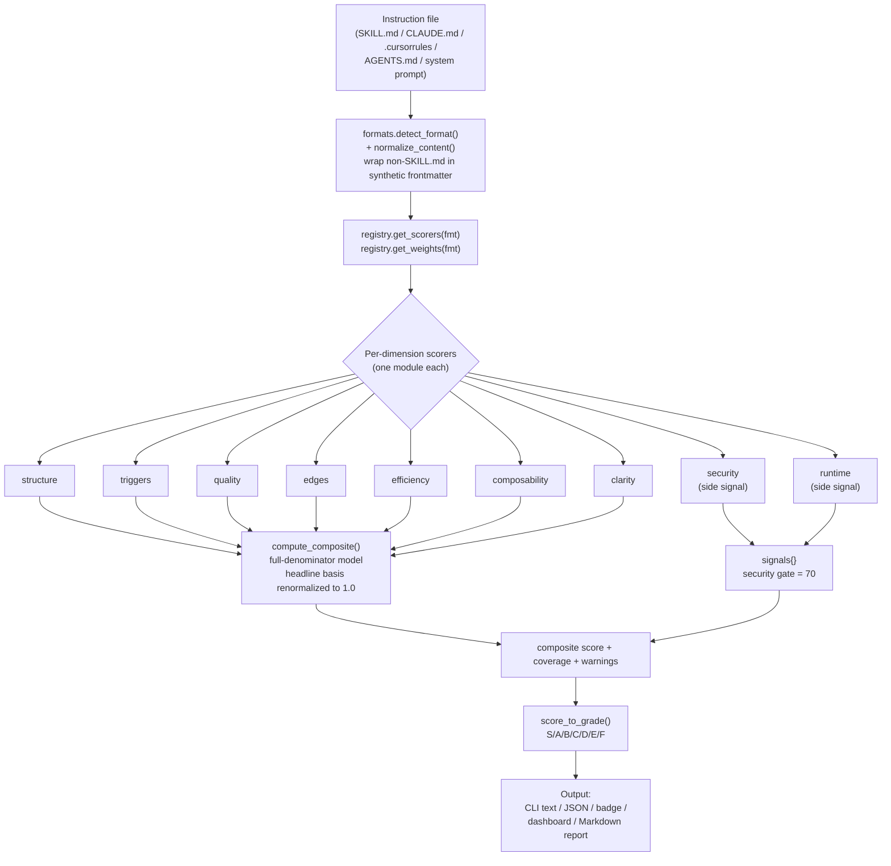
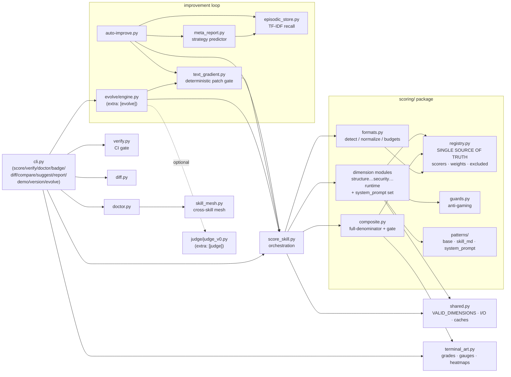

# Schliff Architecture

System design, file tree, data flow, and implementation details for Schliff v8.2.0 —
a deterministic, stdlib-only linter and scoring engine for Claude Code skills and other
LLM instruction files.

---

## Design Principles

- **Zero core dependencies.** The core engine is stdlib-only (`requires-python >=3.9`).
  `litellm` / `anthropic` are *optional* extras (`[evolve]`, `[judge]`) used only for the
  LLM-judge smoke test and the optional LLM rewrite path in `evolve/`. A plain
  `pip install schliff` pulls in nothing but the standard library.
- **Deterministic.** Same input → same score. The headline composite always uses the
  canonical weights from the registry. Ambient per-machine calibration is **OFF by default**
  so that `verify`, `badge`, and the leaderboard are reproducible across machines.
- **Single source of truth.** `scoring/registry.py` is the canonical definition of *which*
  scorers run per format and *how* they are weighted. Every entrypoint derives its scorer
  list and weights from the registry — there is no second hardcoded list anywhere.
- **Measure first, then fix.** The improvement loop scores a baseline, identifies the
  highest-impact patches, applies them, re-scores, and keeps or reverts each change.
- **Multi-format.** SKILL.md, CLAUDE.md, `.cursorrules`, AGENTS.md, and system prompts are
  all first-class. Non-SKILL.md content is normalized to SKILL.md shape so the scorers run
  unchanged.

---

## File Tree

```
skills/schliff/scripts/
├── cli.py                    # CLI entrypoint; subparsers + _resolve_version (importlib.metadata)
├── shared.py                 # VALID_DIMENSIONS, file I/O, caches, URL allowlist, regex guards
├── terminal_art.py           # score_to_grade / _GRADE_THRESHOLDS, gauges, heatmaps, badges
│
├── scoring/                  # SCORING PACKAGE — one module per dimension
│   ├── __init__.py           # public API: re-exports every score_* function + compute_composite
│   ├── registry.py           # CANONICAL weights + scorer lists per format; HEADLINE_EXCLUDED; aliases
│   ├── composite.py          # compute_composite — full-denominator model + SECURITY_GATE
│   ├── formats.py            # detect_format / normalize_content / FORMAT_TOKEN_BUDGETS
│   │
│   ├── structure.py          # skill.md-family dimension scorers
│   ├── triggers.py
│   ├── quality.py
│   ├── edges.py
│   ├── efficiency.py
│   ├── composability.py
│   ├── clarity.py
│   ├── security.py           # opt-in side signal (skill.md family) / core dim (system_prompt)
│   ├── runtime.py            # opt-in side signal — never in any headline composite
│   │
│   ├── structure_prompt.py   # system_prompt-format scorers
│   ├── output_contract.py
│   ├── completeness.py
│   ├── coherence.py          # returns {bonus, details}; consumed internally by quality.py
│   │
│   ├── diff.py               # score_diff / explain_score_change (used by `diff` command)
│   ├── guards.py             # anti-gaming / adversarial-input detection
│   └── patterns/             # pre-compiled regex pattern data
│       ├── base.py           # shared patterns
│       ├── skill_md.py       # skill.md-family patterns
│       └── system_prompt.py  # system_prompt patterns
│
├── score_skill.py / score-skill.py        # scoring orchestration (builds per-dim scores)
├── auto-improve.py                         # autonomous improvement loop
├── text_gradient.py / text-gradient.py     # deterministic patch gradients (apply gate)
├── measure_patch_ratio.py                  # canonical source for the rule-based patch-ratio claim
├── episodic_store.py / episodic-store.py   # cross-session episodic memory (TF-IDF recall)
│
├── verify.py                 # CI gate — exit codes, --min-score, --regression
├── doctor.py                 # health check across all installed skills
├── drift.py                  # score-drift detection over time
├── track.py                  # history tracking
├── sync.py                   # skill discovery / sync
├── skill_mesh.py / skill-mesh.py           # cross-skill trigger-overlap + scope-collision mesh
├── dashboard.py              # single-skill health dashboard (gauges, bars, recommendations)
├── progress.py               # convergence / progress analysis
├── report.py                 # report rendering helpers
├── generate-report.py        # shareable Markdown report + heatmap
├── meta_report.py / meta-report.py         # strategy predictor + weight calibration
├── achievements.py           # unlockable achievement badges
├── parallel_runner.py / parallel-runner.py # git-worktree parallel experiments
├── runtime-evaluator.py      # live Claude invocation testing (runtime signal)
├── nlp.py                    # tokenization, stemming, synonym expansion
├── init-skill.py             # eval-suite bootstrapper with auto-discovery
│
├── evolve/                   # optional LLM-assisted evolution (extra: [evolve])
│   ├── engine.py             # run_evolution loop (deterministic patches first, LLM fallback)
│   ├── budget.py  plateau.py guard.py lineage.py
│   ├── content.py  prompts.py llm.py  sanitize.py
│
├── judge/                    # optional LLM-judge smoke test (extra: [judge])
│   └── judge_v0.py
│
├── analyze-skill.sh          # shell analysis wrapper
├── run-eval.sh               # binary assertion engine
├── test-integration.sh       # integration self-test suite
└── test-self.sh              # dogfooding self-test suite
```

> Hyphenated scripts (e.g. `score-skill.py`) are CLI/shell entrypoints. Their underscore
> twins (`score_skill.py`) are thin import shims so other Python modules can
> `import score_skill` — Python module names cannot contain hyphens. The same pairing exists
> for `text_gradient`, `skill_mesh`, `parallel_runner`, `meta_report`, `episodic_store`, and
> `score_skill`.

The pytest suite lives at `skills/schliff/tests/` (`unit/`, `proof/`, `fixtures/`) and
collects **1198 tests**. The shell suites (`test-self.sh`, `test-integration.sh`) run
separate self / integration proofs.

---

## The Scoring Package

`scoring/` is the heart of the engine. Each scoring dimension is an isolated module that
returns a uniform `{"score": int, "issues": list, "details": dict}` shape. A score of `-1`
means "not measured / not applicable" — the dimension stays in the basis but contributes 0
(see the composite model below).

### Dimensions and weights (skill.md family)

The skill.md family (SKILL.md, CLAUDE.md, `.cursorrules`) shares **one** registry
of 8 scorers. **7 of them form the headline composite**; `security` and `runtime` are
reported as **separate signals**, not folded into the headline number. AGENTS.md runs
the same 8 scorers **plus `operational_coverage`** and has its own headline profile
(`structure` 0.40 / `operational_coverage` 0.40 / `efficiency` 0.20 — see
`docs/SCORING.md` and `docs/specs/agents-md-operational-coverage.md`).

| Dimension | Weight | Role in skill.md headline |
| --- | --- | --- |
| `structure` | 0.15 | headline |
| `triggers` | 0.20 | headline |
| `quality` | 0.20 | headline |
| `edges` | 0.15 | headline |
| `efficiency` | 0.10 | headline |
| `composability` | 0.10 | headline |
| `clarity` | 0.05 | headline |
| `security` | 0.05 | **separate signal** (opt-in; excluded from skill.md headline, reported in `signals`/`security`) |
| `runtime` | n/a | **separate signal** (no profile weight; never in any headline) |

The 7 headline weights are renormalized to sum to 1.0 once `security` and `runtime` are
removed from the basis (`get_headline_excluded`).

### Format-specific behavior

`system_prompt` is the exception. It has its **own** scorer set and weight profile
(`structure_prompt`, `output_contract`, `efficiency`, `clarity`, `security`,
`composability`, `completeness`). For `system_prompt`, **`security` is a CORE 0.15 headline
dimension that stays in the headline** — only `runtime` is excluded there. The exclusion of
`security` from the headline is **specific to the skill.md / claude.md / cursorrules /
agents.md family**.

### Format token budgets (`formats.py`)

| Format | Budget (tokens) |
| --- | --- |
| skill.md | 2000 |
| claude.md | 2000 |
| cursorrules | 500 |
| agents.md | 3000 |
| system_prompt | 1500 |

Token estimation is the stdlib-only `len(content) // 4` heuristic.

### Anti-gaming

Adversarial-input and gaming detection is part of the engine, not a bolt-on: `guards.py`
plus per-scorer logic detect padding, keyword stuffing, and other attempts to inflate a
dimension without real improvement.

---

## The Registry: Single Source of Truth

`scoring/registry.py` defines:

- `SCORER_REGISTRY` — the list of scorers per format.
- `WEIGHT_PROFILES` — the canonical weight per dimension per format.
- `HEADLINE_EXCLUDED` / `get_headline_excluded(fmt)` — which dims are reported as separate
  signals instead of being folded into the headline (format-aware: `{security, runtime}`
  for the skill.md family, `{runtime}` for system_prompt).
- `OPT_IN_SCORERS` — `{runtime, security}`, off by default.
- `FORMAT_ALIASES` — short `--format` flags (`skill`, `claude`, `cursor`, `agents`,
  `system-prompt`).

Every consumer (`compute_composite`, the orchestrators, the CLI) calls `get_scorers`,
`get_weights`, and `get_headline_excluded` rather than hardcoding lists — so changing a
weight in the registry changes it everywhere at once.

---

## The Composite Model (full-denominator)

`scoring/composite.py::compute_composite` uses a **full-denominator** model:

1. Resolve the canonical weight profile for the format from the registry.
2. Drop the format's headline-excluded dims (`security`/`runtime` for skill.md;
   `runtime` for system_prompt) from the basis — unless the caller explicitly weighted them
   via `custom_weights`.
3. Renormalize the remaining canonical weights to sum to 1.0. **This is the single
   normalization point.**
4. Aggregate `Σ(score · weight)` over **measured** dims only.

Unmeasured dimensions (`score == -1`) contribute **0 and stay in the basis** — they are
never added back and the weights are *not* re-spread across the measured dims. The practical
consequence: a skill's score ceiling equals its **weight coverage**. If only 4 of 7 headline
dims are measured, the score cannot exceed that coverage fraction, and the warning reads:

> `Scored M/N dimensions — the score can't exceed COVERAGE% until the rest are measured.
> Run /schliff:init …`

`security` and `runtime` are emitted in the result under `signals` (and `security`), each
with a `score` and — for security — a `status` of `pass`/`flag` against the
**security gate threshold of 70** (`SECURITY_GATE`).

### Calibration (opt-in, off by default)

Ambient auto-calibrated weights from `~/.schliff/meta/calibrated-weights.json` only apply
when **both** conditions hold: the caller passes `use_calibrated=True` (only the interactive
`score` command does) **and** the env var `SCHLIFF_CALIBRATED_WEIGHTS` is set to a truthy
value (`1`/`true`/`yes`/`on`). When active, the result is stamped `weight_source=calibrated`
and a warning notes the score is **not comparable** to default-weight scores from
`verify`/`badge`/`leaderboard`. `verify`, `badge`, and the leaderboard always keep the
default canonical weights so cross-machine decisions never depend on a process env var.

### Grade scale (`terminal_art.score_to_grade` / `_GRADE_THRESHOLDS`)

| Grade | Threshold |
| --- | --- |
| S | ≥ 95 |
| A | ≥ 85 |
| B | ≥ 75 |
| C | ≥ 65 |
| D | ≥ 50 |
| E | ≥ 35 |
| F | < 35 |

---

## Data Flow: file → score



Key points reflected in the diagram:

- `security` and `runtime` branch off into `signals` for the skill.md family — they do
  **not** feed `compute_composite`'s headline number.
- The headline basis is renormalized to 1.0 **once**, after exclusion, inside
  `compute_composite`. There is no per-run re-spreading of unmeasured-dim weight across
  measured dims.

---

## Module Relationships



`registry.py` sits at the center: every scoring decision — which scorers run, their weights,
and which dims are excluded from the headline — is resolved through it. `shared.py` provides
the cross-cutting utilities (`VALID_DIMENSIONS`, bounded file cache, URL allowlist, regex
guards) and `terminal_art.py` provides all rendering.

---

## The Improvement Loop

`auto-improve.py` (and the optional `evolve/engine.py`) drive autonomous improvement:

1. **Baseline** — score the file via the orchestrator + `compute_composite`.
2. **Gradient** — `text_gradient.py` identifies the highest-impact fixes with predicted
   deltas. On the current corpus **~32% of patches are auto-applied deterministically**
   (12/37; high-confidence, single-edit) through the apply gate; the canonical measurement
   source for that ratio is `measure_patch_ratio.py`. The remainder fall back to the
   optional LLM path.
3. **Apply** — patch the file (atomic `.tmp` + `rename`).
4. **Re-score** — recompute the composite.
5. **Keep or revert** — improvement is kept; a regression (or a single dimension tanking
   past the guard threshold) is reverted.
6. **Continue or stop** — an EMA plateau detector stops on diminishing returns; persistent
   stalls can spin up parallel git-worktree experiments via `parallel_runner.py`.

### Cross-session episodic memory

`episodic_store.py` records what strategies worked, for which skill domains, under what
conditions, in a size-capped TF-IDF index. `recall()` / `synthesize()` surface relevant past
sessions, and `meta_report.py` turns that history into strategy recommendations and (opt-in)
weight calibration before the next run.

---

## The CLI

`cli.py` is the single entrypoint, dispatching to subparsers:

`score`, `verify`, `doctor`, `badge`, `diff`, `compare`, `suggest`, `report`, `demo`,
`version`, `evolve`.

The version is **single-sourced**: `_resolve_version()` reads it dynamically via
`importlib.metadata.version("schliff")`, falling back to `dev` from a source checkout. From
the installed package it resolves to **8.2.0**. There is no hardcoded version string in the
CLI.

---

## Implementation Notes

- **Atomic writes.** Every file write (SKILL.md patches, JSON/JSONL outputs, episodic store)
  uses the `.tmp` + `rename()` pattern so a crash mid-write cannot corrupt a skill file.
- **Regex guards.** Regex operations on user-provided content are guarded against `re.error`
  and pathological complexity (`shared.py` validation patterns); on failure the scorer
  returns a safe default instead of crashing.
- **Encoding.** Reads specify `encoding="utf-8"` with `errors="replace"` for non-UTF-8
  content. JSON reads are explicit UTF-8.
- **Bounded caches.** `shared.py` keeps a module-level file cache capped at
  `MAX_CACHE_ENTRIES` (500); files larger than `MAX_SKILL_SIZE` (1 MB) are rejected to
  prevent DoS via large inputs.
- **URL fetching** is restricted to an allowlist of hosts (`github.com`,
  `raw.githubusercontent.com`, `gitlab.com`, `bitbucket.org`).
